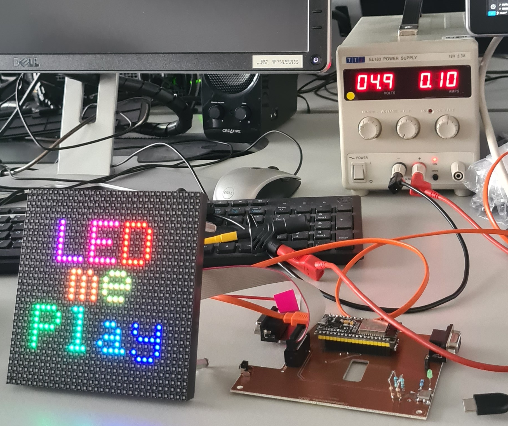

# LEDmeplay-ESP32: Retro Arcade auf dem 32x32 RGB-Matrix-Display

Willkommen zum LEDmeplay-ESP32-Projekt!  

 
Dieses Projekt bringt die klassischen LEDmeplay-Spiele von Mithotronic auf ein neues Level: Mit einem leistungsstarken ESP32 als Herzstück lassen sich mehrere Arcade-Spiele auf einem 32x32 Punkte großen RGB-LED-Matrix-Display ausführen und bequem über ein Startmenü auswählen.  
Ziel ist es, ein modulares Open-Source-System zu bieten, das an das Ursprungsprojekt **LEDmeplay für Arduino Mega 2560** anknüpft, aber durch die neue Hardware umfangreicher, moderner und vielseitiger wird.

## Übersicht

- **Plattform:** ESP32
- **Display:** 32x32 RGB-Matrix-LEDs
- **Projekttyp:** PlattformIO-Projekt (Arduino-Shell)
- **Basis:** Erweiterung des Originals von Mithotronic
- **Weitere Inhalte:** FreeCAD-Dateien (Gehäuse-Design als 3D-Druck), KiCad-Schaltpläne (Elektronik), SVG (Laser-Dateien für Gehäuse)

## Hauptfeatures & Verbesserungen

- **Mehrere Spiele:** Dank ESP32 können viele Spiele im Flash gespeichert und via Startmenü ausgewählt werden.
- **Zentrale Spiele-Bibliothek:** Gemeinsame Spiel-Logik und wiederkehrende Routinen wurden als Bibliothek gekapselt – optimale Basis für eigene Spiele-Entwicklungen und unkomplizierte Erweiterbarkeit.
- **Konstante Spielgeschwindigkeit:** Trotz höherer CPU-Geschwindigkeit laufen die klassischen Spiele weiterhin in Original-Geschwindigkeit.
- **Möglichkeit für aufwendigere Spiele:** Der ESP32 eröffnet neue Potenziale für anspruchsvollere Spiele.
- **Gut dokumentierte Beispieldateien:** CAD- und Layout-Daten unterstützen beim Nachbau.

## Bekannte Einschränkungen

- **IO-Pin-Engpass:** Die verfügbaren Pins des ESP32 sind durch Display, Steuerelemente u.a. Geräte fast vollständig belegt.
- **Gestiegene Komplexität:** Das Management mehrerer Spiele sowie die Menüstrukturen erhöhen die Komplexität des Codes. Dies kann das ursprüngliche Ziel, Einsteigerinnen und Einsteigern das Programmieren beizubringen, erschweren.

## Projektstruktur

Das Repository ist logisch gegliedert – jedes Unterverzeichnis enthält klar umrissene Inhalte für die einzelnen Projektaspekte:

| Verzeichnis         | Inhalt                                                                                  |
|---------------------|----------------------------------------------------------------------------------------|
| `/src`              | Hauptquellcode für das ESP32-Board, inkl. Spiele, Menü, Bibliotheken                   |
| `/lib`              | Wiederverwendbare Bibliotheken für Spiel-Logik, Displaysteuerung usw.                  |
| `/data`             | Ressourcen wie Fonts, Sprites und Leveldaten                                           |
| `/hardware/` | FreeCAD-Dateien für alle Gehäuseteile (STL für 3D-Druck lassen sich daraus erzeugen) sowie SVG-Dateien, um Gehäuseteile (Frontplatte, Halterungen) mit dem Lasercutter zu fertigen  |
| `/hardware/KiCad/`   | KiCad-Projektdateien, Schaltpläne und Boardlayouts für die Elektronik                  |
| `/docs`             | Dokumentation, Tutorials, Installationsanleitungen                                     |

## Installation & Quickstart

1. **Voraussetzungen**
    - ESP32-Board
    - Windows, Mac oder Linux mit [PlatformIO](https://platformio.org/) und Arduino-Core
    - Lötkolben und Basiselektronik-Kenntnisse für Aufbau

2. **Firmware flashen**
    - Repository klonen:
      ```bash
      git clone https://github.com/RT-CUSTOMZ/LEDmePlay.git
      ```
    - PlatformIO-Projekt in VSCode öffnen
    - Board- und Port-Einstellungen anpassen (siehe `platformio.ini`)
    - Kompilieren & Upload:
      ```bash
      pio run --target upload
      ```

3. **Spiele auswählen**
    - Das Startmenü erscheint automatisch nach dem Boot.
    - Spiele lassen sich über angeschlossene Taster auswählen und starten.

## Hardware & Gehäuse

- **3D-Druckteile:**  
  Im Verzeichnis `/hardware/freecad` findest du alle FreeCAD-Dateien (FCStd), mit denen du die Gehäuseteile (z.B. Frontplatten, Halterungen) direkt im 3D-Drucker als STL exportieren kannst.

- **Elektronik und Platinen:**  
  Die Schaltpläne und Board-Layouts sind im Verzeichnis `/hardware/kicad` als KiCad-Projekt (Schaltplandateien, PCB) abgelegt.

- **Laser-Dateien:**  
  Vorlagen für Lasercutter (z.B. Acryl-Front, Tasten-Bohrungen) befinden sich unter `/hardware/`.

## Eigene Spiele entwickeln

- Die gemeinsame Spielelogik steht als Bibliothek unter `/lib` zur Verfügung.
- Beispielprojekte im `/src`-Verzeichnis können dupliziert und angepasst werden.

## Hinweise & Credits

- Dieses Projekt basiert auf dem genialen Ansatz von [Mithotronic LEDmeplay](https://mithotronic.de/ledmeplay.php)
- Bitte respektiere Lizenzen und Quellen beim Weiterverbreiten und Forken.
- Feedback, Fehlerberichte und Spielbeiträge gerne als Pull Request!

**Viel Spaß mit LEDmeplay-ESP32!**
